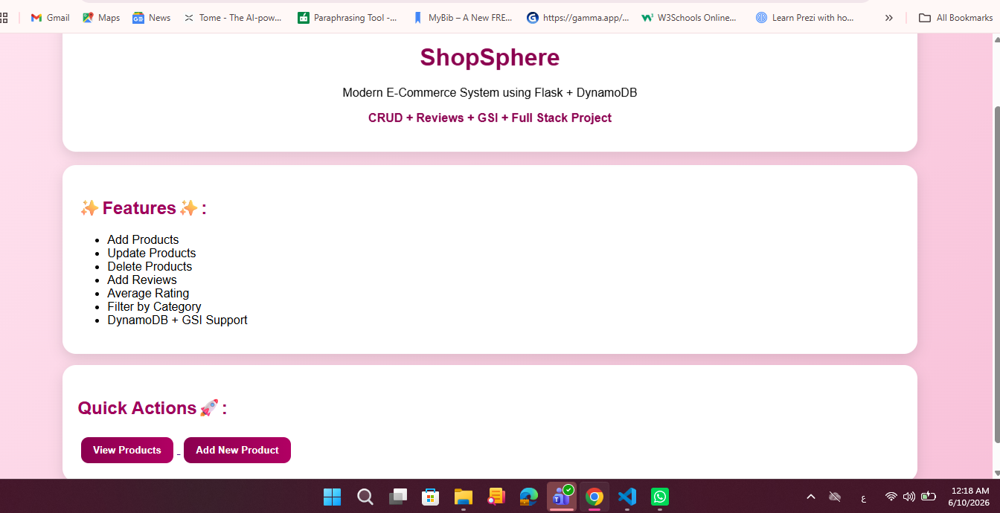
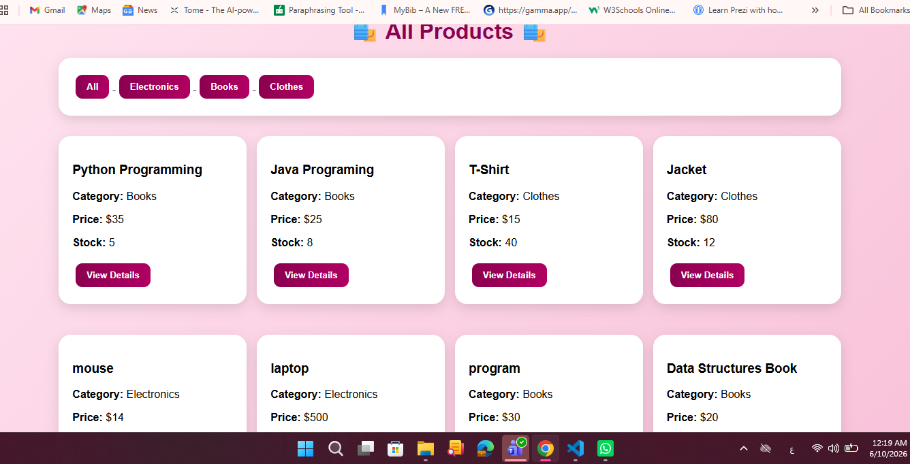
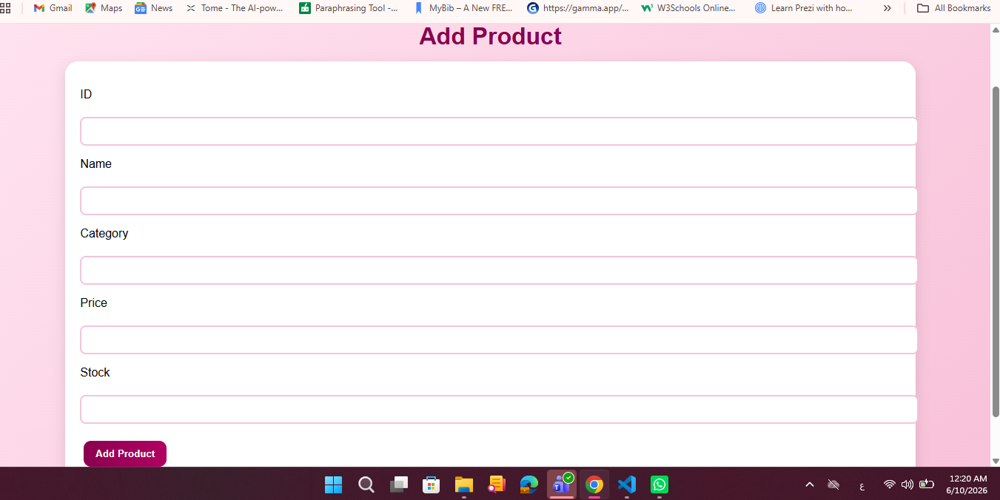
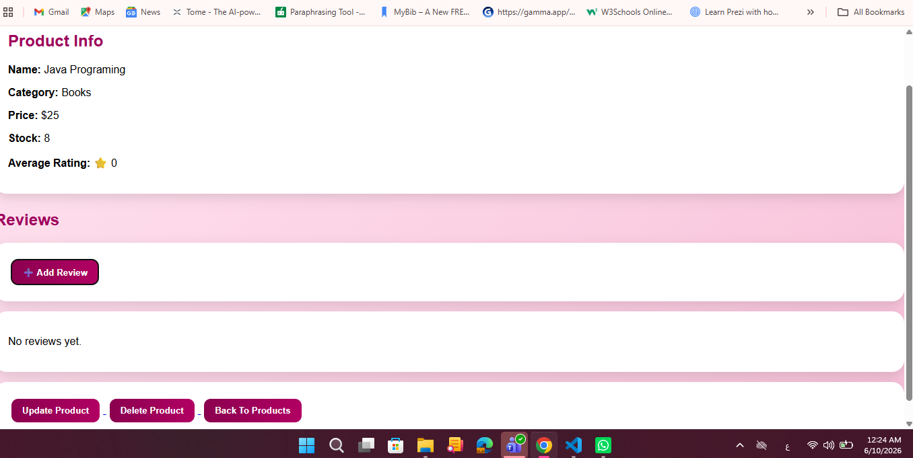
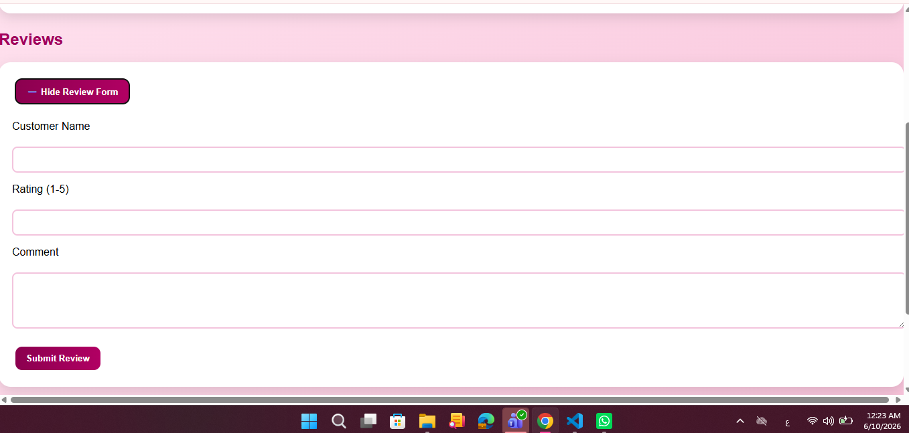
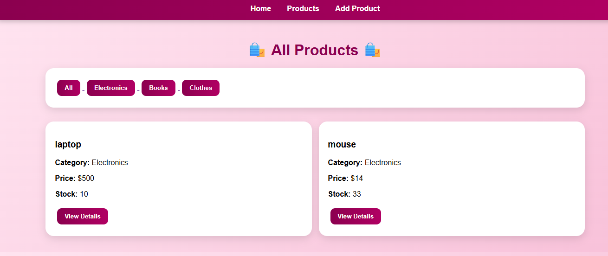

# ShopSphere

## Project Overview

ShopSphere is an e-commerce web application built using Flask and Amazon DynamoDB.

The system allows users to:

* Add products
* View products
* Update products
* Delete products
* Add reviews
* View reviews
* Calculate average ratings
* Filter products by category using GSI

---

## Technologies Used

* Python
* Flask
* Amazon DynamoDB
* Boto3
* HTML
* CSS
* java script

---

## DynamoDB Design

### Product

PK = PRODUCT#ID

SK = META

Attributes:

* name
* category
* price
* stock

### Review

PK = PRODUCT#ID

SK = REVIEW#timestamp

Attributes:

* customer_name
* rating
* comment

---

## Global Secondary Index (GSI)

GSI1

Partition Key:

category

Used for filtering products by category without using Scan.

---

## Features

* Product CRUD Operations
* Review System
* Average Rating Calculation
* Category Filtering
* Responsive User Interface

---

## How to Run

1. Install requirements

pip install -r requirements.txt

2. Configure AWS credentials

3. Run the application

python app.py

4. Open browser

http://127.0.0.1:5000

---
## Screenshots

### Home Page

### Products Page

### Add Product

### Product Details

### Add Review

### Category Filter

